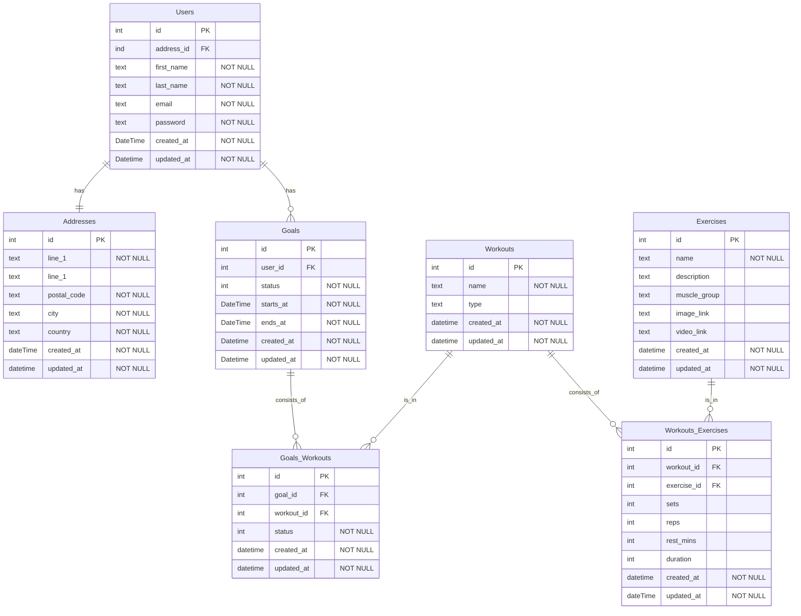

# High level story
This application will help a user to create and keep track of fitness goals. Each goal consists of several workouts that consists of predefined exercises.  
# ER-Diagram

```mermaid
erDiagram
   Users ||--|| Addresses : has
   Users ||--o{ Goals : has
   Goals ||--o{ Goals_Workouts: consists_of
   Workouts ||--o{ Goals_Workouts: is_in
   Workouts ||--o{ Workouts_Exercises: consists_of
   Exercises ||--o{ Workouts_Exercises: is_in
   
   Users{
    int id PK
    ind address_id FK
    text first_name "NOT NULL"
    text last_name "NOT NULL"
    text email "NOT NULL"
    text password "NOT NULL"
    DateTime created_at "NOT NULL"
    Datetime updated_at "NOT NULL"
   }
   Addresses{
       int id PK
       text line_1 "NOT NULL"
       text line_1 
       text postal_code "NOT NULL"
       text city "NOT NULL"
       text country "NOT NULL"
       dateTime created_at "NOT NULL"
       datetime updated_at "NOT NULL"
    }
   Goals {
       int id PK
       int user_id FK
       int status "NOT NULL"
       DateTime starts_at "NOT NULL"
       DateTime ends_at "NOT NULL"
       Datetime created_at "NOT NULL"
       Datetime updated_at "NOT NULL"
   } 
   Goals_Workouts {
       int id PK
       int goal_id FK
       int workout_id FK
       int status "NOT NULL"
       datetime created_at "NOT NULL"
       datetime updated_at "NOT NULL"
   }
   Workouts{
       int id PK
       text name "NOT NULL"
       text type
       datetime created_at "NOT NULL"
       datetime updated_at "NOT NULL"      
   }
   Workouts_Exercises {
       int id PK
       int workout_id FK
       int exercise_id FK
       int sets
       int reps
       int rest_mins
       int duration
       datetime created_at "NOT NULL"
       dateTime updated_at "NOT NULL"
   }
   Exercises{
       int id PK
       text name "NOT NULL"
       text description
       text muscle_group
       text image_link
       text video_link
       datetime created_at "NOT NULL"
       datetime updated_at "NOT NULL"      
   }
```